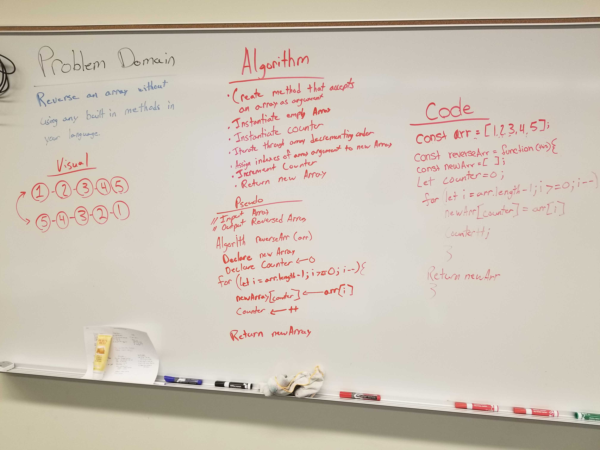

# Reverse an Array
Reverse given array and return the reversed array.

## Challenge
Write a function called reverseArray which takes an array as an argument. Without utilizing any of the built-in methods available to your language, return an array with elements in reversed order.

## Approach & Efficiency
<!-- What approach did you take? Why? What is the Big O space/time for this approach? -->
The approach that was to declare a function that takes in an array as an argument. This function also declares an array literal and sets a counter variable to 0. The function will then loop through the array that is passed through the array in a decrementing manner. Within this loop, the new array will have it's indexes assigned by the array that is being looped through while incrementing the counter variable. This will return a new array in reversed manner.

## Links and Resources
* [submission PR](http://xyz.com)

## Solution

