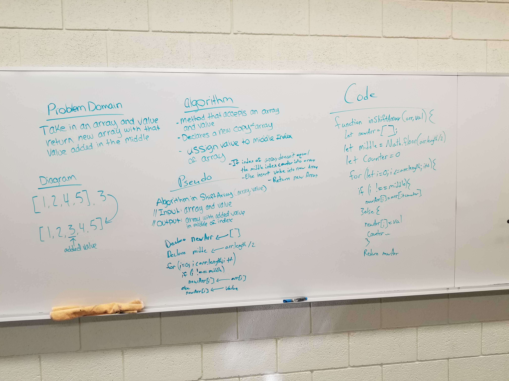

# Challenge Summary
Return an array that places the value in the middle of the array.

## Challenge Description
Write a function called insertShiftArray which takes in an array and the value to be added. Without utilizing any of the built-in methods available to your language, return an array with the new value added at the middle index.

## Approach & Efficiency
Declare a method that accepts and array and a value. Within that method declare a new instace of an empty array. Assign the value to the middle index of the new array by looping through the argument array, if the index doesn't match the middle index, insert the value of that index from the argument array into the new array. Otherwise, insert the value argument into the new array.

 ## Link to Code
 * [Code Link](./array-shift.js)
 * [Test Link](./__tests__/array-shift.test.js)

## Solution

