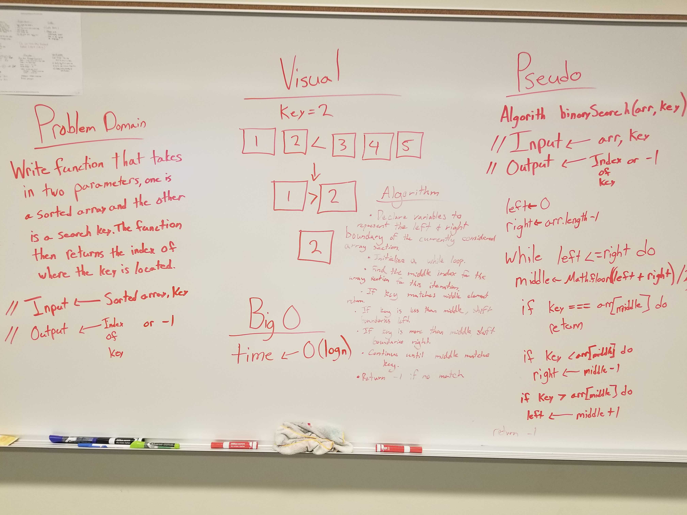
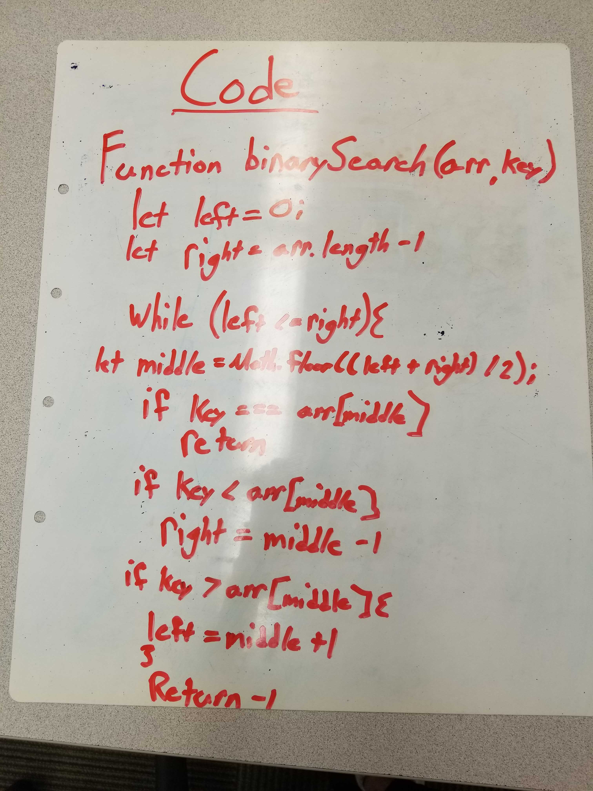

# Challenge Summary
Return the index of given target value in array.

## Challenge Description
Write a function called BinarySearch which takes in 2 parameters: a sorted array and the search key. Without utilizing any of the built-in methods available to your language, return the index of the array’s element that is equal to the search key, or -1 if the element does not exist.

## Approach & Efficiency
Within the function declare three variables that represent the start, middle and end of the array. These will represent the indexes. Then we will initialize a while loop that will continuously loop through the array until the target parameter is equal to the middle index. If the middle index is less than the array, then end variable will switch to the middle index for the next iteration of the while loop. If the middle index is greater than the array, then the start index will switch to the middle index for the next iteration until the function can narrow down the middle variable to equal the target.

 ## Link to Code
 * [Code Link](./array-binary-search.js)
 * [Test Link](./__tests__/array-binary-search.test.js)

## Solution

