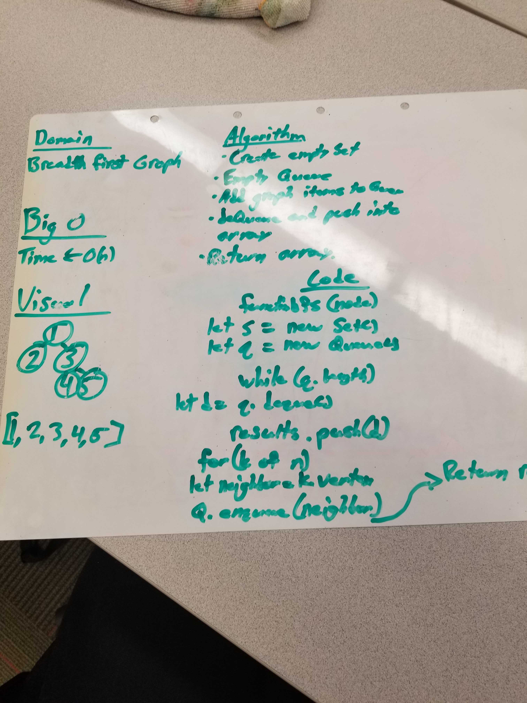

# Challenge Summary
Write a function that traverses through a graph in a breadth first search.

## Challenge Description
Extend your graph object with a breadth-first traversal method that accepts a starting node. Without utilizing any of the built-in methods available to your language, return a collection of nodes in the order they were visited. Display the collection.

## Approach & Efficiency
The approach was to create a set and two empty arrays that will hold the values as the graph is traversed through. If the set has current values then they get pushed onto the queue and then dequeue into the result array as the iteration completes. Once the queue is empty, then return the result array containing the order the graph was traversed through.

 ## Link to Code
 * [Code Link](./graph-bfs.js)
 * [Test Link](./__tests__/graph-bfs.test.js)

## Solution

