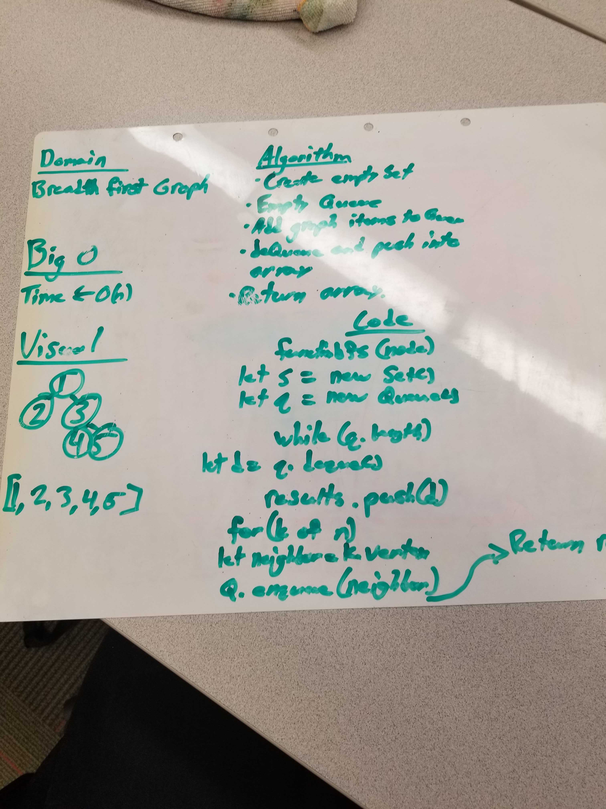
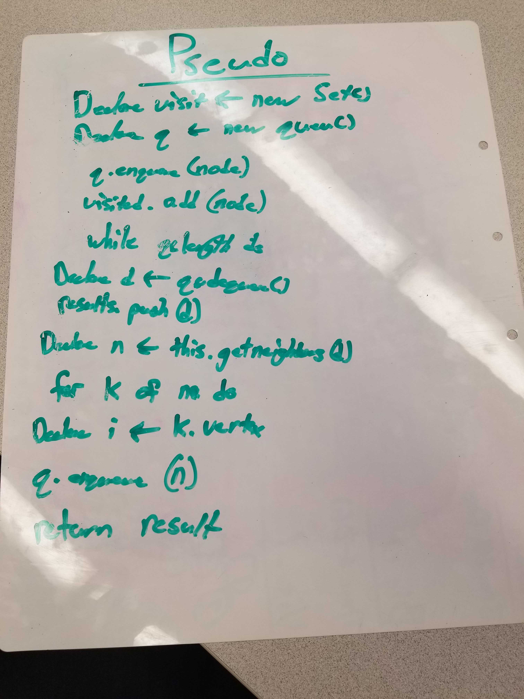

# Challenge Summary
Write a function that traverses through a graph in a depth first search.

## Challenge Description
Create a function that accepts an adjacency list as a graph, and conducts a depth first traversal. Without utilizing any of the built-in methods available to your language, return a collection of nodes in their pre-order depth-first traversal order.

## Approach & Efficiency
The approach is to create a stack and as items are added on the stack as the graph traverses through the nodes, they are then popped off the stack which replicates the depth first approach of traversal. 0(n) efficiency.

 ## Link to Code
 * [Code Link](./graph-dfs.js)
 * [Test Link](./__tests__/graph-dfs.test.js)

## Solution

