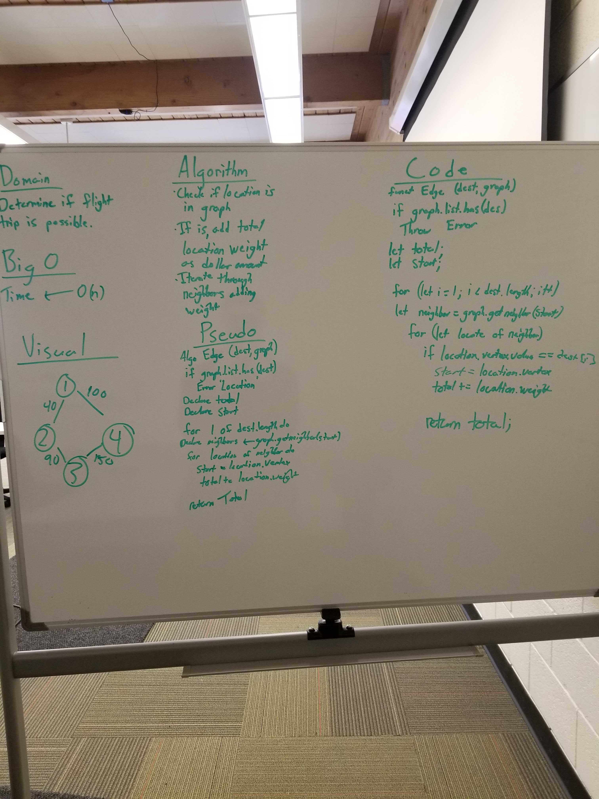

# Challenge Summary
Write a function based on the specifications above, which takes in a graph, and an array of city names. Without utilizing any of the built-in methods available to your language, return whether the full trip is possible with direct flights, and how much it would cost.

## Challenge Description
Write a function based on the specifications above, which takes in a graph, and an array of city names. Without utilizing any of the built-in methods available to your language, return whether the full trip is possible with direct flights, and how much it would cost.

## Approach & Efficiency
The approach was to first test if the location exists in the graph. If the location does exist in the graph then loop through those locations and all their neighbors while adding their location weights as the total dollar amount of for the cost of the trip.

 ## Link to Code
 * [Code Link](./graph-edge.js)
 * [Test Link](./__tests__/graph-edge.test.js)

## Solution

