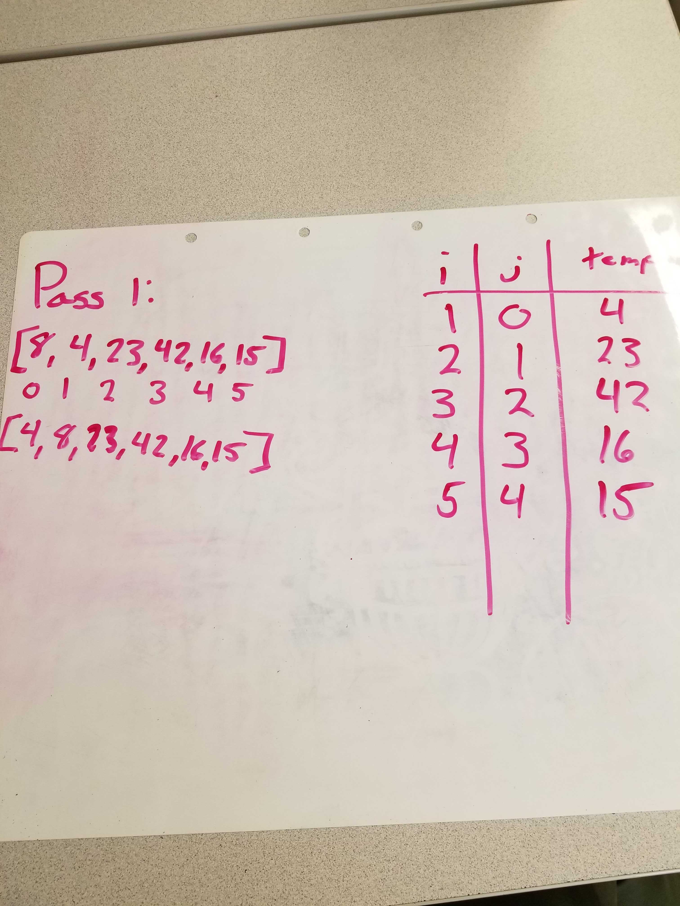
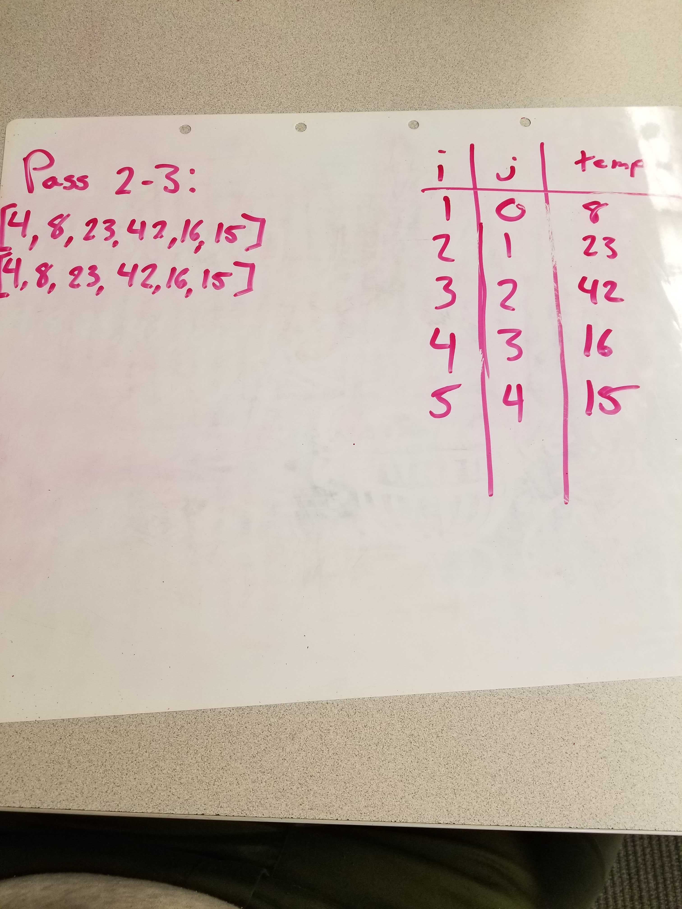
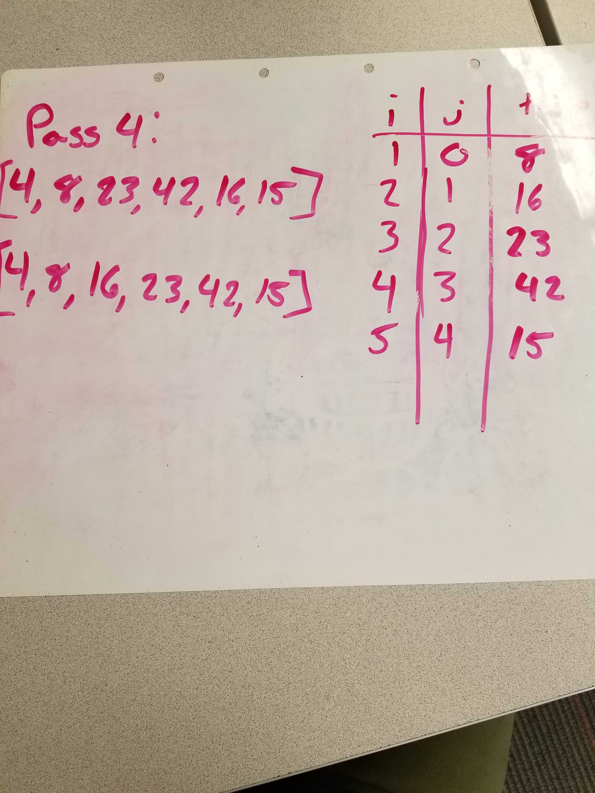
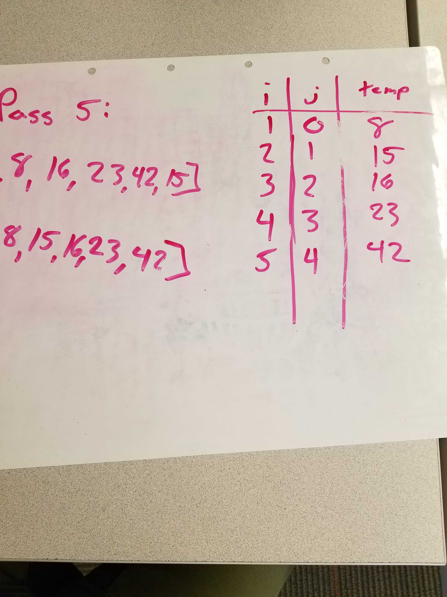

### Pass 1:

In the first pass through of the insertion sort, we evaluate the first index compared to the zero index. If the first index is greater, then swap the first and zero index.
### Pass 2:

In the second and third pass through, we will compare their previous indexes. If they are less than their previous index, then swap places and compare to the next lesser index. These swaps will keep happening until the previous index is either greater or you are at the beginning of the array.
### Pass 3:

In the second and third pass through, we will compare their previous indexes. If they are less than their previous index, then swap places and compare to the next lesser index. These swaps will keep happening until the previous index is either greater or you are at the beginning of the array.
### Pass 4:

In the second and third pass through, we will compare their previous indexes. If they are less than their previous index, then swap places and compare to the next lesser index. These swaps will keep happening until the previous index is either greater or you are at the beginning of the array.