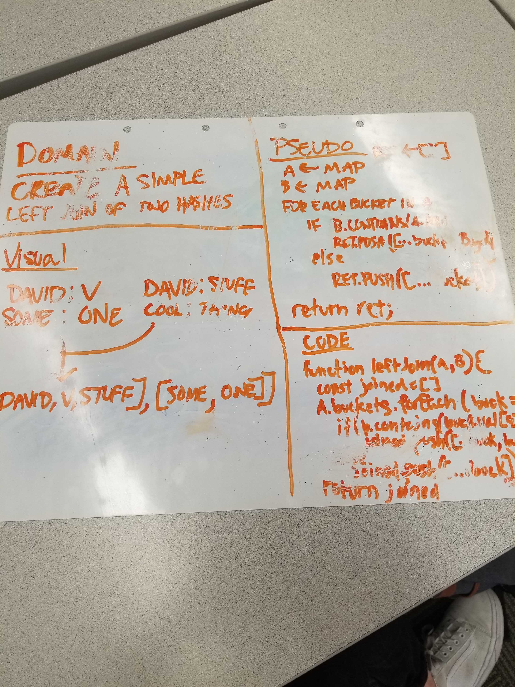

# Challenge Summary
Write a function that takes returns values in Binary Tree.

## Challenge Description
Write a breadth first traversal method which takes a Binary Tree as its unique input. Without utilizing any of the built-in methods available to your language, traverse the input tree using a Breadth-first approach, and return a list of the values in the tree in the order they were encountered.

## Approach & Efficiency
The approach is a 0(n) efficiency. The approach is to create an empty array that gets values pushed into it was the function iterates through the left hash table. During the iteration, the values from the second hash table will be pushed into the array and that array will be returned with all the appropriate values.

 ## Link to Code
 * [Code Link](./leftJoin.js)
 * [Test Link](./__tests__/leftJoin.test.js)

## Solution

