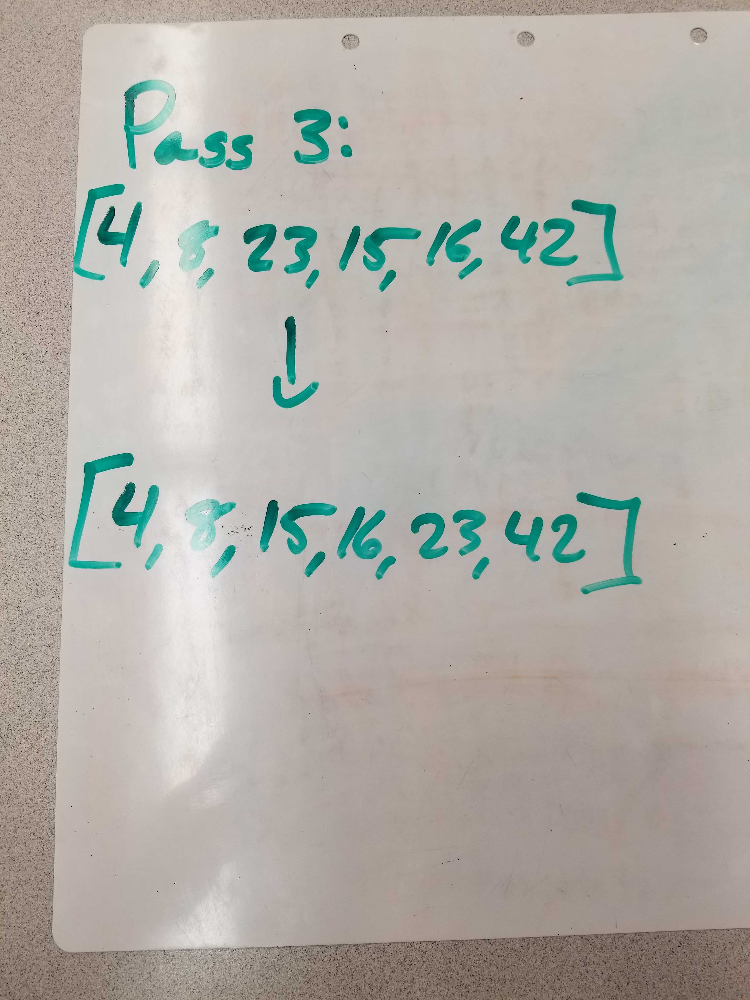

# Challenge Summary
* Provide a visual step through for each of the sample arrays based on the provided pseudo code
* Convert the pseudo-code into working code in your language
* Present a complete set of working tests

## Challenge Description
Review the pseudocode below, then trace the algorithm by stepping through the process with the provided sample array. Document your explanation by creating a blog article that shows the step-by-step output after each iteration through some sort of visual.

## Approach & Efficiency
The efficiency that was used in the pseudocode is 0(n). The approach is to loop through the array and compare the targeted index with the one before it. If it's less than the number than it will trade places and compare against the next number. This happens on both sides of the array and at the end it will concatenate the two sides together in a sorted fashion.

 ## Link to Code
 * [Code Link](./mergeSort.js)
 * [Test Link](./__tests__/mergeSort.test.js)

## Solution
