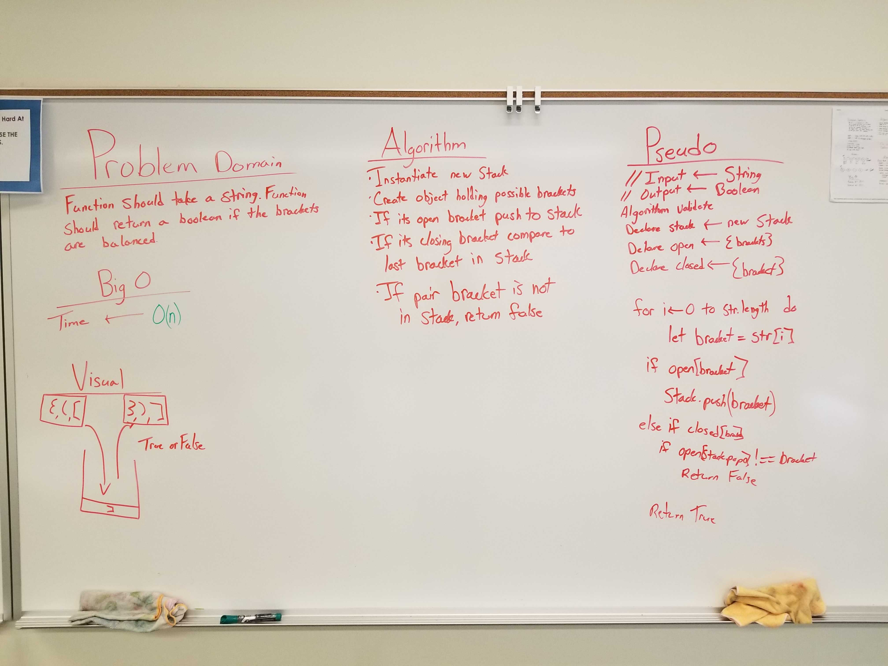
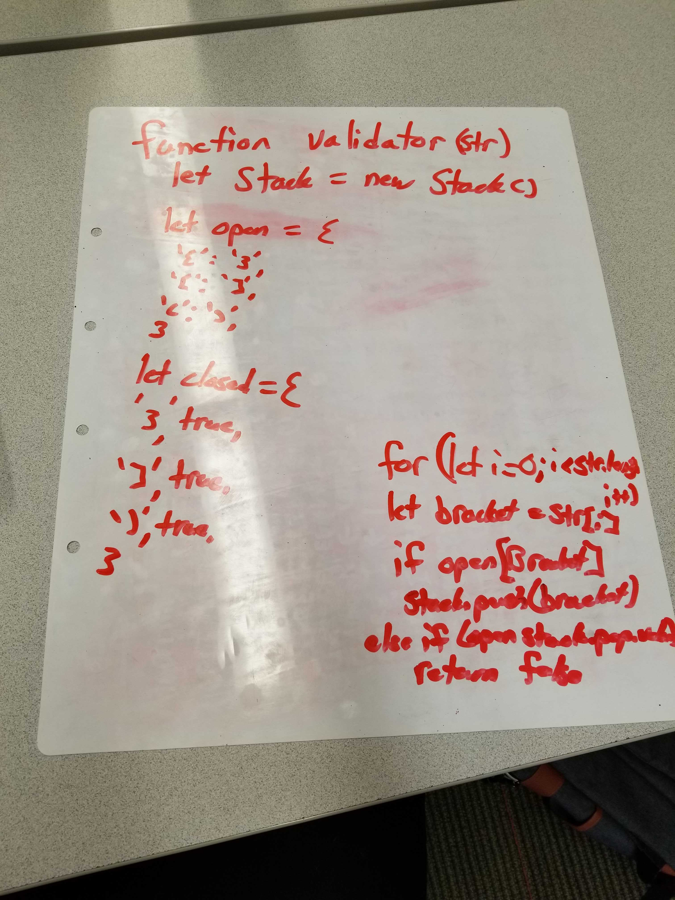

# Challenge Summary
Write a function that takes a string and returns a boolean if the brackets are balanced.

## Challenge Description
Write a function that takes a string and returns a boolean if the brackets are balanced.

## Approach & Efficiency
My approach is to instantiate and new Stack object and set two objects representing either the open or closed brackets. I then iterate through the values in the string and if they are the open brackets then I push them on to the stack. If they are the closed brackets, then I pop the last value placed on the stack and compare the two values. If they match, then the function returns true, if they don't match then it returns false.

 ## Link to Code
 * [Code Link](./multi-bracket-validation)
 * [Test Link](./__tests__/multi-bracket-validation.test.js)

## Solution

