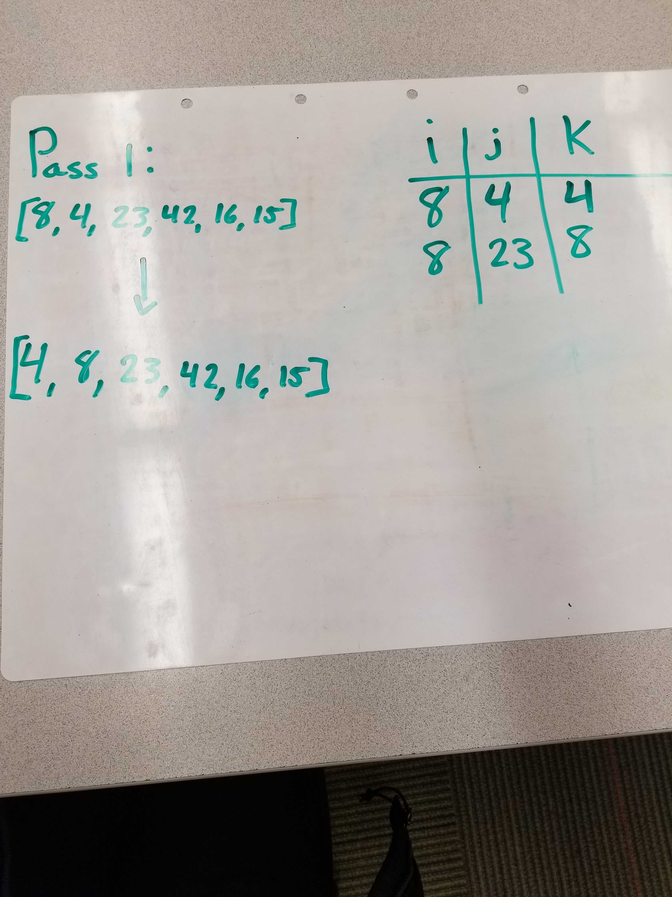
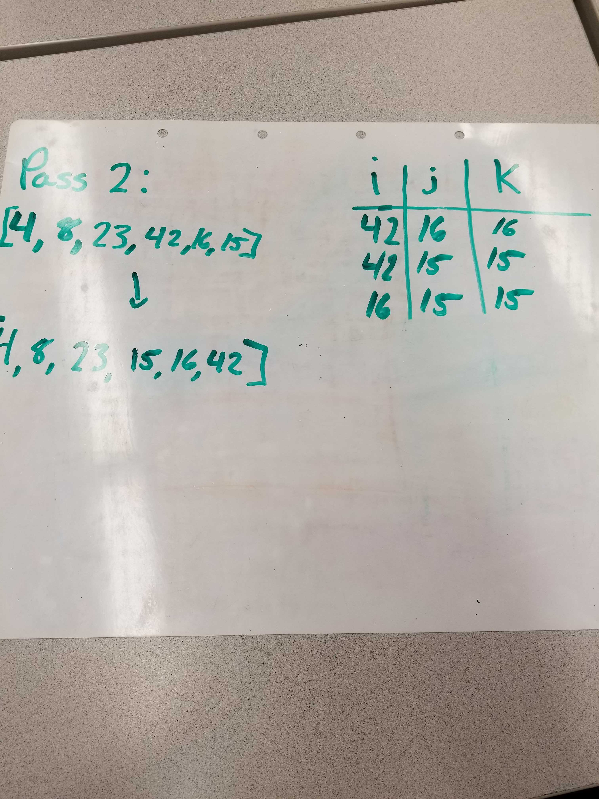
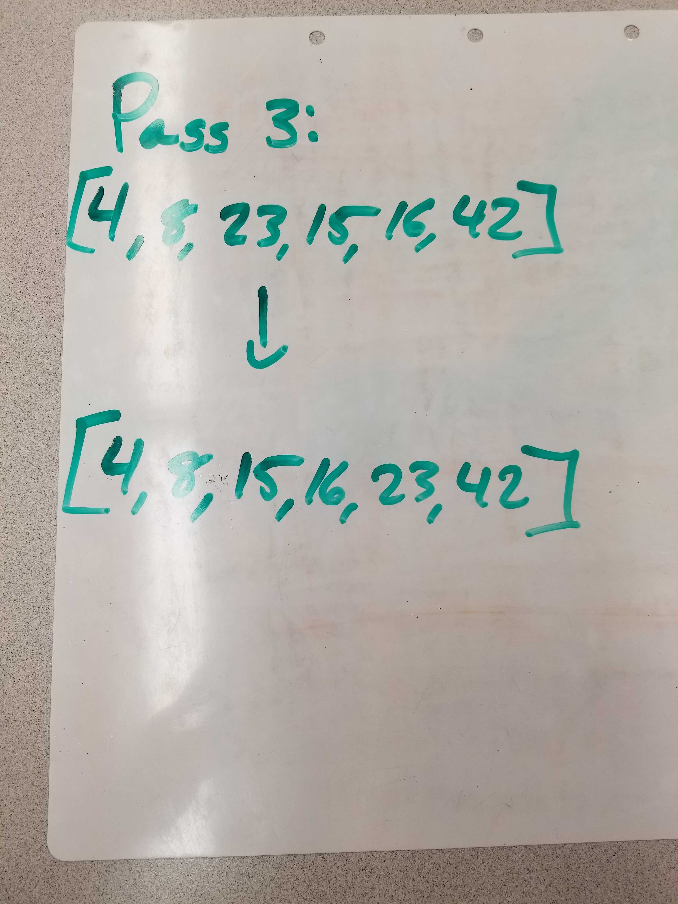

### Pass 1:

In the first pass through of the quick sort, we take the first half of the array and compare the indexes while swapping the lesser indexes to the first value.
### Pass 2:

In the second and third pass through, we will compare the right side of the array and sort them in order of their values.
### Pass 3:

In the second and third pass through, we concatenate the two sorted halves of the array and return the merge sorted array.