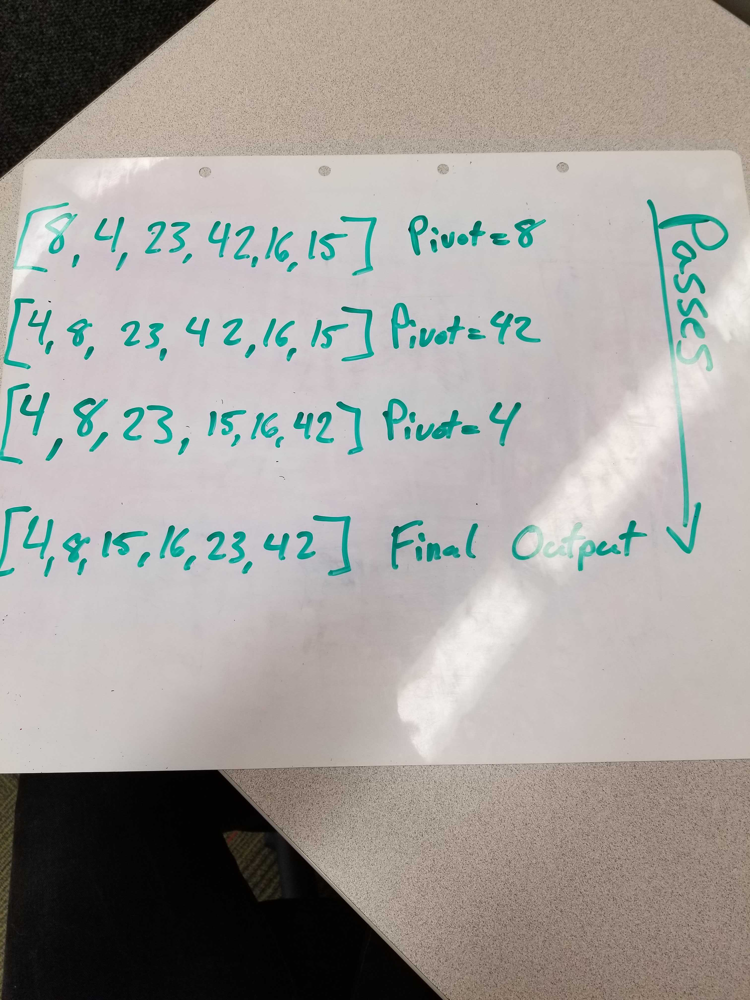

### Quick Sort:

Quick sort starts by initiliazing a pivot point that will be used to compare values as it recursively iterates through the arrays. Within this given method, the unsorted array will be split into two sides, one that holds the lesser values, and another that will hold the greater values. Within these seperate arrays, there will be two new pivot points assigned so they can be also sorted.

Once the two seperate arrays have been sorted, then they will be concatenated together at the end to return a new array that holds the sorted values.