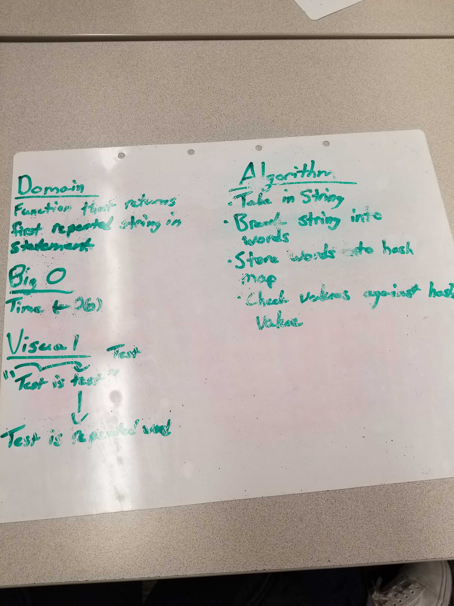
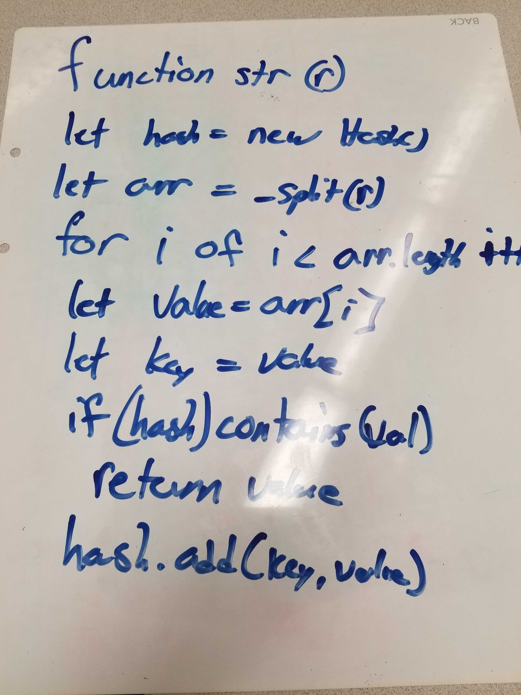

# Challenge Summary
Write a function that accepts a lengthy string parameter.
Without utilizing any of the built-in library methods available to your language, return the first word to occur more than once in that provided string.

## Challenge Description
Write a function that accepts a lengthy string parameter.
Without utilizing any of the built-in library methods available to your language, return the first word to occur more than once in that provided string.

## Approach & Efficiency
The efficiency that was used is 0(n). The approach is to split the string into an array that is able to be looped through and added to the hash map. During this loop, the function will check to see if the value is already contained in the hash table. If it is, then return that value, if not, then add the value to the hash table.

 ## Link to Code
 * [Code Link](./repeatedWord.js)
 * [Test Link](./__tests__/repeatedWords.test.js)

## Solution

