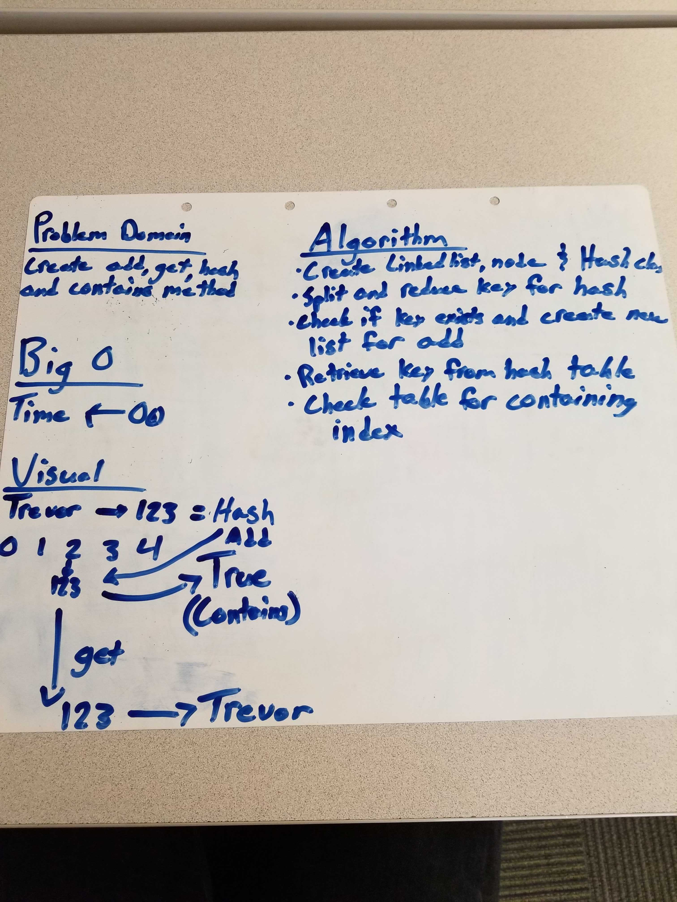
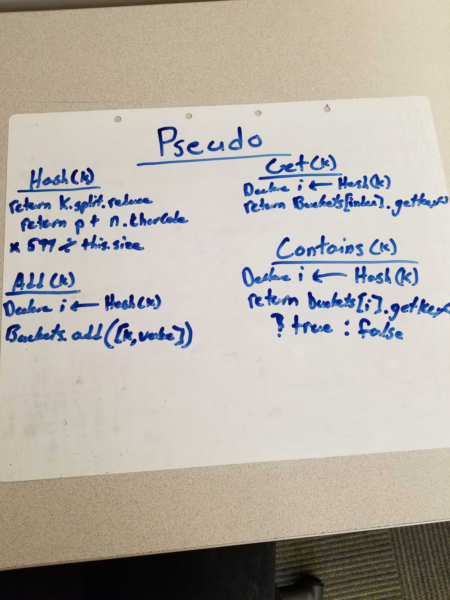

# Hash Table
A Hash Table is a data structure that holds inputted data in their key value pairs. It placed within the table with indexes and if there are collisions can be sorted through with a Linked List to retrieve that particular data.

## Challenge
Implement a Hashtable with the following methods:

* add: takes in both the key and value. This method should hash the key, and add the key and value pair to the table, handling collisions as needed.
* get: takes in the key and returns the value from the table.
* contains: takes in the key and returns a boolean, indicating if the key exists in the table already.
* hash: takes in an arbitrary key and returns an index in the collection.

## Approach & Efficiency
The approach I took was creating a Node, Stack and PseudoQueue class. Within these classes are their respected methods that are focused on an efficiency of 0(1), but in certain methods will need an 0(n) for the traversal of the data structure. The `dequeue` method within the PseudoQueue will have an efficiency of 0(n) for the traversal through the stack.

## API

### Linked List
* `add(value)` - Adds a node to the end of the Linked List
* `getKey(key)` - Retrieves key from hashmap
* `values()` - Pushes values into array and returns array

### Hash Table
* `hash(key)` - Hashes key argument
* `add(key, value)` - Adds key and value to hash table
* `get(key)` - Retrieves key from hash table
* `contains(key)` - Returns boolean if hash table contains key

## Links
* [submissionPR](https://github.com/trevorthompson-401-advanced-javascript/data-structures-and-algorithms/pull/29)
* [travis](https://travis-ci.com/trevorthompson-401-advanced-javascript/data-structures-and-algorithms/builds/150099740)
* [docs](/docs)

## Links to Code
* [codeLink](hashTable.js)
* [testLink](__tests__/hashTable.test.js)

## UML

