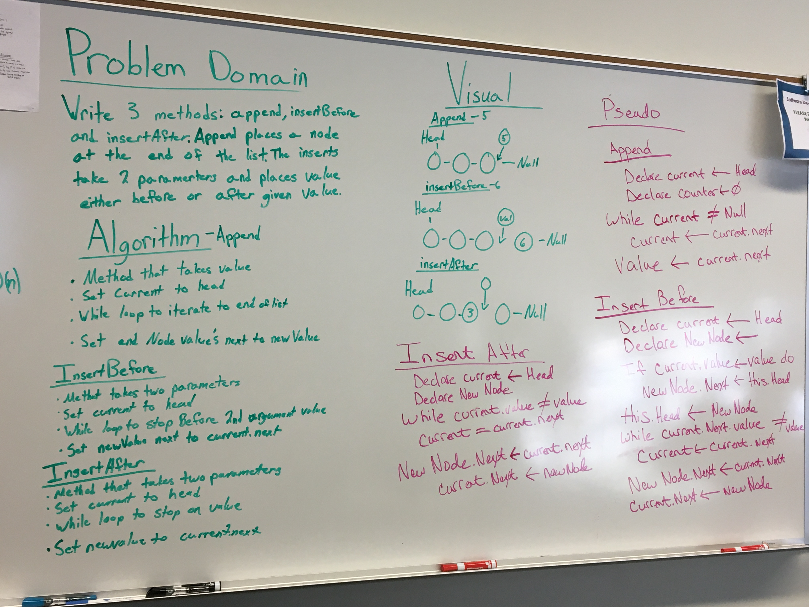
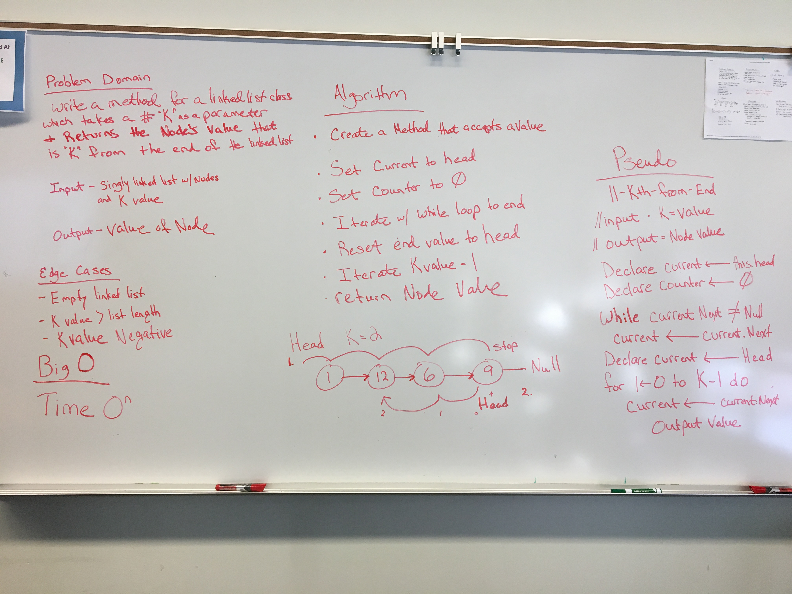
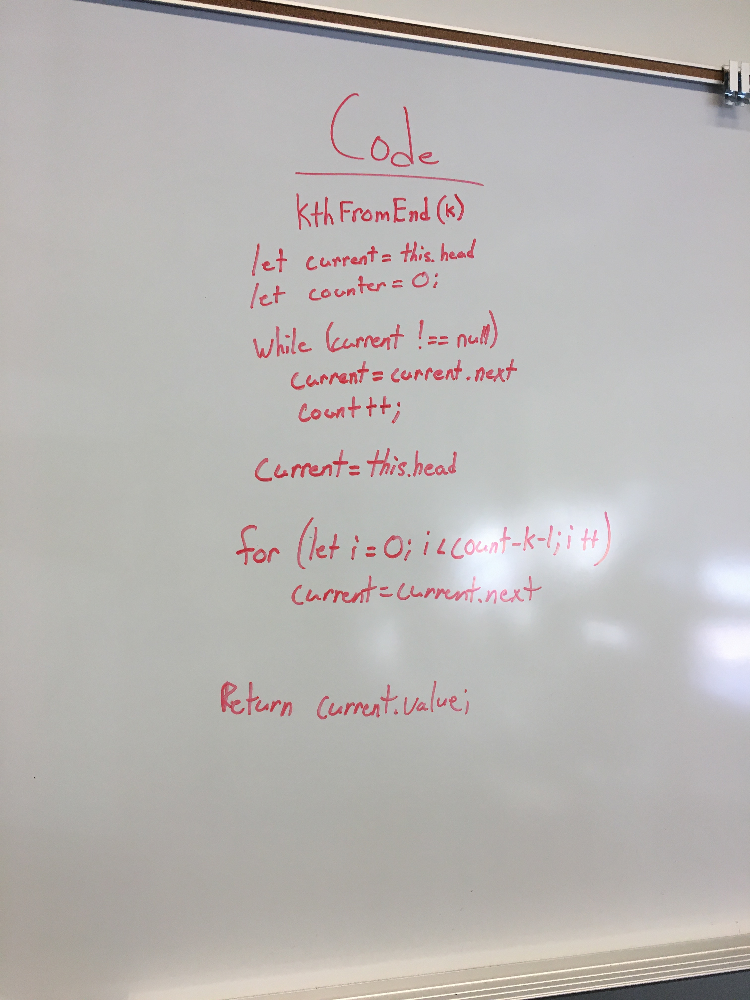

# Single Linked List
Linked lists are linear data structures that don't hold elements at contiguous locations.

## Challenge
Create a Node and LinkedList class that has the ability to insert new values into the linked list and test if certain values exist in the array. Also, implement a method that returns a collection of the values in string format.

## Approach & Efficiency
The approach I took was defining the Node class first with the proper value and next. Then defining the LinkedList Class that has the head value. Within the LinkedList Class is all the underlying methods to manipulate the linked list. All of the methods listed within the linked list class are focused on having a 0(1) or 0(n).

## API
insert(value) - Inserts value at the beginning of the linked list
includes(value) - Iterates through list checking if value exists in the list
toString() - Iterates through list attaching values to a string and returning the collection
append(value) - Inserts value at the end of the linked list
insertBefore(val, newValue) - Inserts newValue before val in the linked list
insertAfter(val, newValue) - Inserts newValue after the val in the linked list
remove(val) - Removes value from the linked list
kthFromEnd(k) - k represents how far into the list from the end, kthFromEnd() will return the value of that node
merge(listA,listB) - We are looping through listA and appending listB at the end of listA

## Links
* [submissionPR](https://github.com/trevorthompson-401-advanced-javascript/data-structures-and-algorithms/pull/1)
* [travis](https://travis-ci.com/trevorthompson-401-advanced-javascript/data-structures-and-algorithms/builds/144070892)
* [docs](/docs)

## UML

