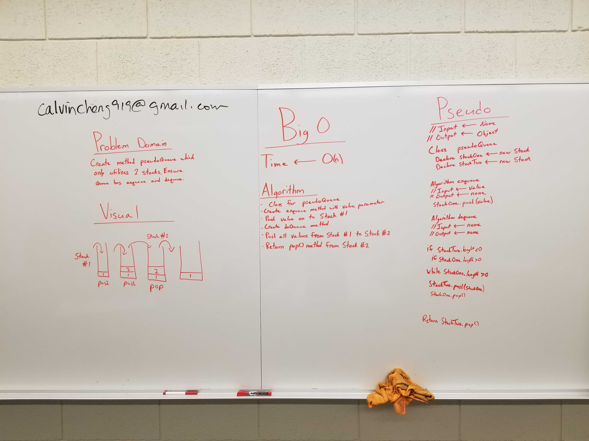
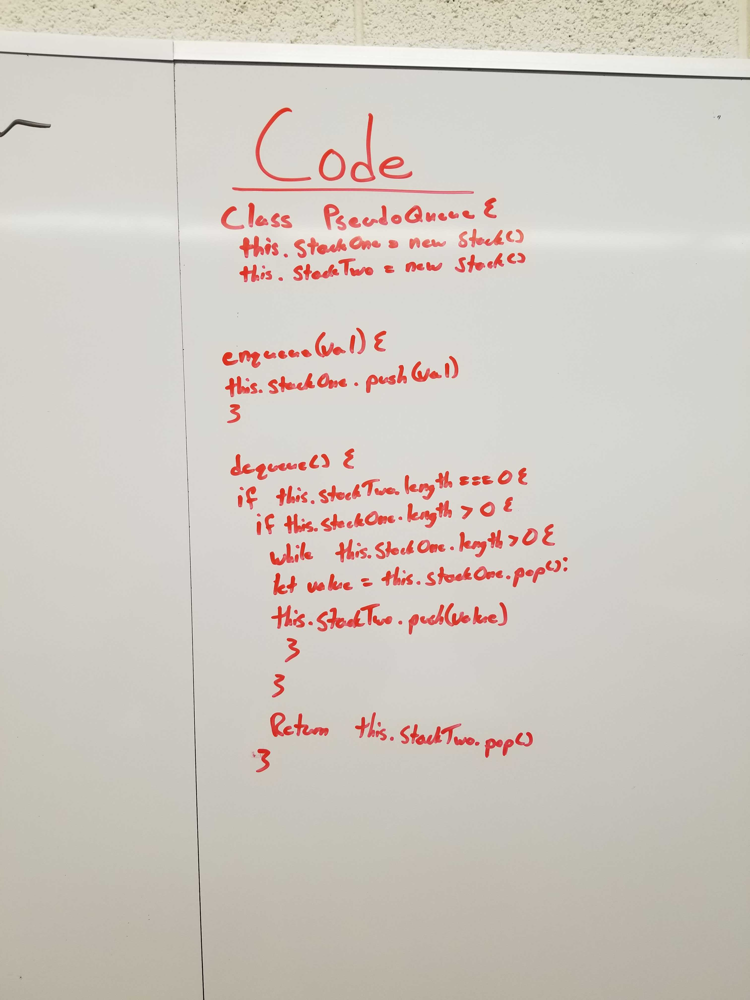

# Stacks and Queues
A Stack is a data structure that consists of Node's in a vertical column. A Queue is a data structure that consists of Nodes that are placed in the queue on one side and dequeued from the other side.

## Challenge
Create a brand new PseudoQueue class. Do not use an existing Queue. Instead, this PseudoQueue class will implement our standard queue interface (the two methods listed below), but will internally only utilize 2 Stack objects. Ensure that you create your class with the following methods.

## Approach & Efficiency
The approach I took was creating a Node, Stack and PseudoQueue class. Within these classes are their respected methods that are focused on an efficiency of 0(1), but in certain methods will need an 0(n) for the traversal of the data structure. The `dequeue` method within the PseudoQueue will have an efficiency of 0(n) for the traversal through the stack.

## API

### Stack
* `push(value)` - Adds a node to the top of the stack
* `pop()` - Removes the top node from the stack
* `peek()` - Returns the top node from the stack

### Queue
* `enqueue()` - Adds a node the end of the queue
* `dequeue()` - Removes node from the front of the queue
* `peek()` - Returns the front node from the queue

## Links
* [submissionPR](https://github.com/trevorthompson-401-advanced-javascript/data-structures-and-algorithms/pull/13/)
* [travis](https://travis-ci.com/trevorthompson-401-advanced-javascript/data-structures-and-algorithms/builds/144421889)
* [docs](/docs)

## Links to Code
* [codeLink](queue-with-stacks.js)
* [testLink](__tests__/queue-with-stacks.test.js)

## UML

