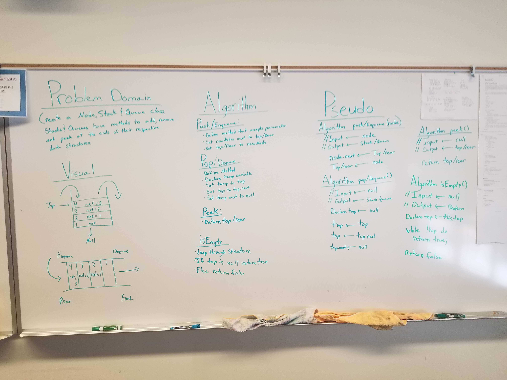

# Stacks and Queues
A Stack is a data structure that consists of Node's in a vertical column. A Queue is a data structure that consists of Nodes that are placed in the queue on one side and dequeued from the other side.

## Challenge
Create a Node, Queue and Stack class that all have the ability to add and remove nodes from their respective data structures. Also, give them the ability to peek the top item in the stack.

## Approach & Efficiency
The approach I took was creating a Node, Stack and Queue class. Within these classes are their respected methods that are focused on an efficiency of 0(1), but in certain methods will need an 0(n) for the traversal of the data structure.

## API

### Queue
* `push(value)` - Adds a node to the top of the stack
* `pop()` - Removes the top node from the stack
* `peek()` - Returns the top node from the stack
* `isEmpty()` - Returns boolean based on the stack being empty

### Stack
* `enqueue()` - Adds a node the end of the queue
* `dequeue()` - Removes node from the front of the queue
* `peek()` - Returns the front node from the queue
* `isEmpty()` - Returns boolean based on the queue being empty

## Links
* [submissionPR](https://github.com/trevorthompson-401-advanced-javascript/data-structures-and-algorithms/pull/15/)
* [travis](https://travis-ci.com/trevorthompson-401-advanced-javascript/data-structures-and-algorithms/builds/145268849)
* [docs](/docs)

## Links to Code
* [codeLink](stacks-and-queues.js)
* [testLink](__tests__/stacks-and-queues.test.js)

## UML

